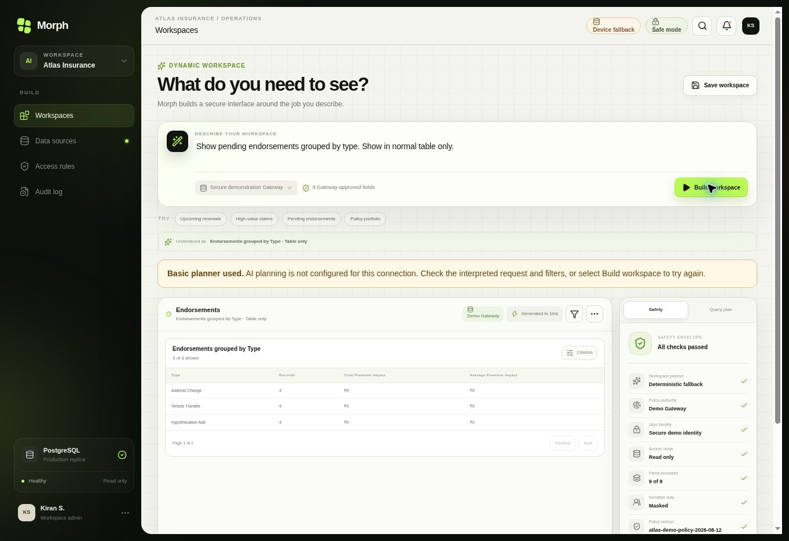

# Dependency security update — 22 September 2026

This closes the critical/high dependency follow-up from the [21 September review](engineering-review-2026-09-21.md). It is a dependency maintenance release, not approval for a real-data pilot.

## Audit outcome

| Lockfile | Before | After |
| --- | --- | --- |
| Application | 23: 1 critical, 13 high, 8 moderate, 1 low | 4 moderate; zero critical, high or low |
| Client Gateway | 0 | 0 |

These are npm advisory results on 22 September, not a guarantee that the application has no vulnerabilities. `npm run audit:security` checks both lockfiles and fails on high/critical findings or audit errors. It is an explicit release check, not a scheduled CI job.

## Changes and compatibility

- Next and its ESLint configuration: 16.2.6 → 16.3.5.
- Vite: 8.0.13 → 8.3.0.
- Cloudflare Vite plugin: 1.37.1 → 1.57.1, with Wrangler 4.136.1 and matching workers-types 5.20260921.1. Types v5 removes the `/latest` entrypoint; TypeScript now uses the documented package-root entrypoint. The plugin brings its declared Miniflare 5 alpha dependency; preview and Worker build checks cover that compatibility boundary.
- Drizzle Kit: 0.31.10 → 0.31.11. Both migration generators still report no schema changes.
- Refreshed vulnerable transitive packages within parent constraints, including Babel, brace-expansion, browserslist, fast-uri, fflate, js-yaml, postcss, sharp, undici and ws.
- Scoped `image-size: 2.0.4` override only under `vinext@0.0.50`, avoiding a major/beta framework migration. Vinext's consumer uses `imageSize(Buffer)` and width/height. PNG and SVG parsing pass; a zero-length ICNS entry throws instead of looping, under a bounded subprocess check. Reassess/remove the override when upgrading Vinext.

Dependency installation used `--ignore-scripts`. Lockfile changes and newly changed lifecycle-script packages (esbuild and workerd binary installers) were reviewed. No force install or peer-dependency bypass was used. Declared peers pass `npm ls --depth=0`.

Primary release references: [Next 16.3.5](https://github.com/vercel/next.js/releases/tag/v16.3.5), [Vite 8.3.0](https://github.com/vitejs/vite/releases/tag/v8.3.0), [Cloudflare releases](https://github.com/cloudflare/workers-sdk/releases), [Drizzle Kit 0.31.11](https://github.com/drizzle-team/drizzle-orm/releases/tag/drizzle-kit@0.31.11), and the installed workers-types README. Package registry metadata and installed parser source were checked where release pages were unavailable.

## Remaining moderate advisory

The four audit entries are one dependency chain: `drizzle-kit` → `@esbuild-kit/esm-loader` → `@esbuild-kit/core-utils` → `esbuild@0.18.20`. [GHSA-67mh-4wv8-2f99](https://github.com/advisories/GHSA-67mh-4wv8-2f99) concerns esbuild's development-server CORS behavior. The reviewed loader calls transform/transformSync, not serve/context; that server path is not used by this application or its Gateway. Do not expose a server using this nested esbuild package. Drizzle Studio is separate development tooling and should remain local.

Retained rather than applying npm's breaking downgrade to Drizzle 0.18.1 or overriding an explicit `~0.18.20` dependency across breaking minor versions. Recheck by **28 September 2026** and before enabling any new tooling/server path; update when Drizzle replaces the deprecated loader. Owner: MorphUI maintainers.

## Verification and limits

Lint, TypeScript, 40 workspace/Gateway/database tests, Gateway compilation, both migration generators, parser checks and the high-severity audit gate pass. Final production packaging includes the rendered-Worker test. PostgreSQL integration uses PGlite; Docker and Windows were not exercised.

Supervised browser preview on the updated Cloudflare runtime successfully generated a table-only pending-endorsements workspace: three groups, 12 matching records, no chart or KPI cards. Preview has no provider secret and clearly labels basic-planner fallback; it does not verify current Gemini service availability. Production provider settings are unchanged.

Employee SSO, tenant-bound authorization, rate limits, credential rotation and real client onboarding remain separate pilot work from the previous review. Existing owner-private access is retained.
